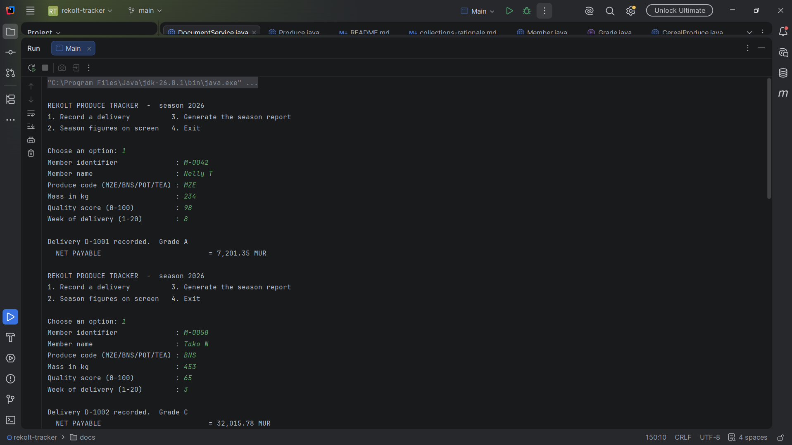
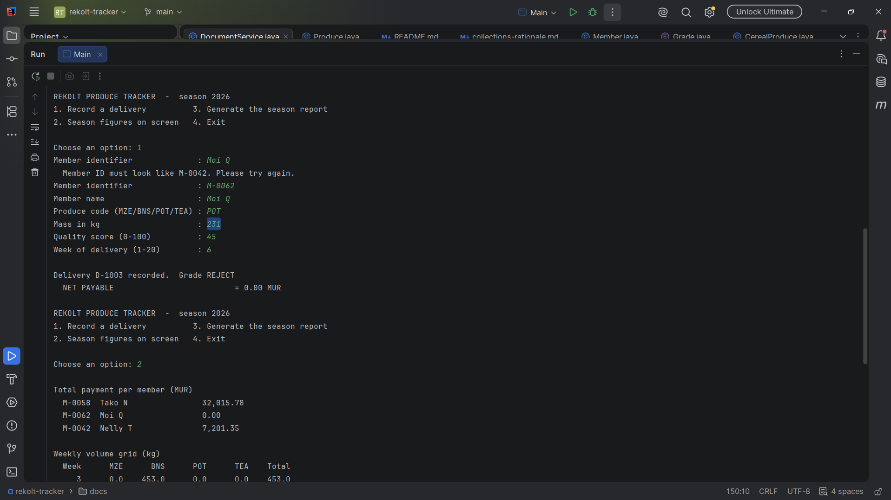
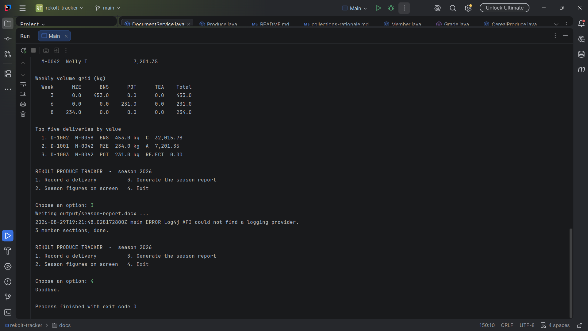

# REKOLT Planters' Cooperative Produce Tracker

A console-based Java application built for the REKOLT Planters' Cooperative to replace a
manual, paper-and-calculator process for computing seasonal payments to smallholder members.
The application records deliveries, applies a fixed five-step payment rule consistently to
every delivery, answers season-level questions on screen, and generates a single Microsoft
Word document containing every member's payment statement.

## Requirements

- JDK 17 or later (built and tested on JDK 26)
- No separate Maven installation needed — this project uses the Maven Wrapper (`mvnw` /
  `mvnw.cmd`), which downloads the correct Maven version automatically
- An internet connection on first build, so Maven can download dependencies
  (notably Apache POI)

## How to build and run, from a clean clone

1. Clone the repository:

```bash
git clone https://github.com/Nellyvine/rekolt-tracker.git
cd rekolt-tracker
./mvnw clean compile
```

On Windows PowerShell or Command Prompt, use `.\mvnw.cmd clean compile` if `./mvnw` isn't recognised.

### Running the application

**Option A — IntelliJ IDEA (recommended):**
Open the project folder in IntelliJ, open `src/main/java/mu/rekolt/app/Main.java`, and click the green Run arrow next to `public class Main`.

**Option B — from the terminal, after building:**
```bash
java -cp target/classes mu.rekolt.app.Main
```
## Usage

On launch, the console presents a menu:


| Option | What it does |
|---|---|
| **1. Record a delivery** | Prompts for member ID (`M-0042` format), member name, produce code (`MZE`/`BNS`/`POT`/`TEA`), mass in kg, quality score (0–100), and week (1–20). Every field is validated and re-prompted on invalid input. |
| **2. Season figures on screen** | Displays total payment per member, a weekly volume grid by produce, and the top five deliveries by value. |
| **3. Generate the season report** | Writes `output/season-report.docx` — one payment-statement section per member (each starting on a new page) followed by a reconciling season-totals page — and appends a timestamped entry to `output/run-log.txt`. |
| **4. Exit** | Closes the application cleanly. |

## Project Structure

rekolt-tracker/
├── docs/
│ ├── setup/ JDK, IDE and git setup evidence
│ ├── git/ merge history evidence
│ ├── design/ Objective 4 design documents (scope, UML, pseudocode, data dictionary)
│ ├── screenshots/ sample-output screenshots referenced in this README    
│ └── collections-rationale.md
├── output/
│ ├── season-report.docx
│ └── run-log.txt
└── src/main/java/mu/rekolt/
├── app/ console entry point (Main.java)
├── model/ Produce hierarchy, Member, Delivery, Grade, Payable, Reportable
├── service/ ProduceCatalog, SeasonService, DocumentService
└── util/ ConsoleInput, Formatter

## Payment Calculation Rules

| Step | Rule |
|---|---|
| 1. Base price | MZE 30 · BNS 90 · POT 45 · TEA 25 (MUR/kg) |
| 2. Grade multiplier | A (85–100) ×1.15 · B (70–84) ×1.00 · C (50–69) ×0.85 · REJECT (<50) ×0.00 |
| 3. Category multiplier | Cereal ×1.00 · Perishable ×0.90 · Cash crop ×1.10 |
| 4. Commission | 5% of the value after step 3 |
| 5. Transport levy | 2 MUR per kg delivered |

**Net payable** = value after step 3, minus commission, minus transport levy. A REJECT delivery is still recorded and counted in volume statistics, but its value is zero and no deductions are taken from it.

All intermediate values are computed at full `double` precision; rounding to two decimals happens only when a value is displayed or printed.

## Sample Output

### Main menu and recording a delivery


### Season figures on screen


### Generated season-report.docx & Exit



## Documentation

- [`docs/design/`](docs/design) — Objective 4 on-paper design: scope and assumptions, numbered functional/non-functional requirements, noun-verb analysis, UML class diagram, activity diagram, pseudocode, and data dictionary
- [`docs/collections-rationale.md`](docs/collections-rationale.md) — justification for every collection type used and the alternatives considered
- [`docs/setup/`](docs/setup) — environment and version-control setup evidence
- [`docs/git/`](docs/git) — branch and merge history evidence

## Verifying the Calculation

The worked example from the assignment specification — member `M-0042`, 236 kg of beans, quality score 91 
computes to  **22,732.70 MUR** net payable, matching the specification's reference figures
to the cent.
